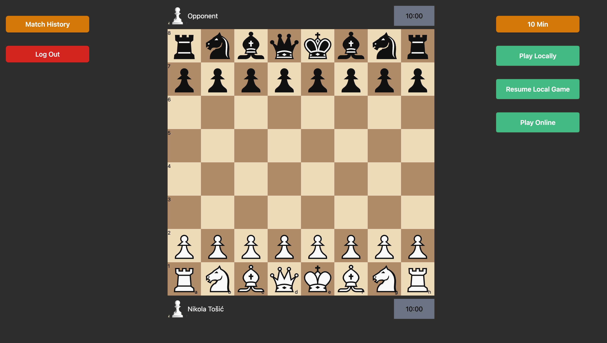
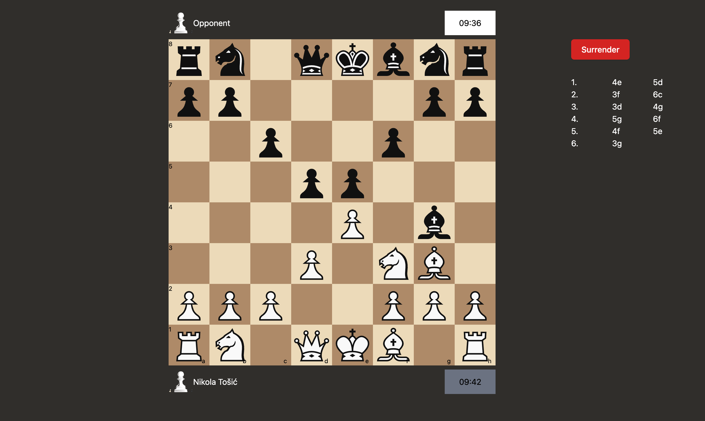
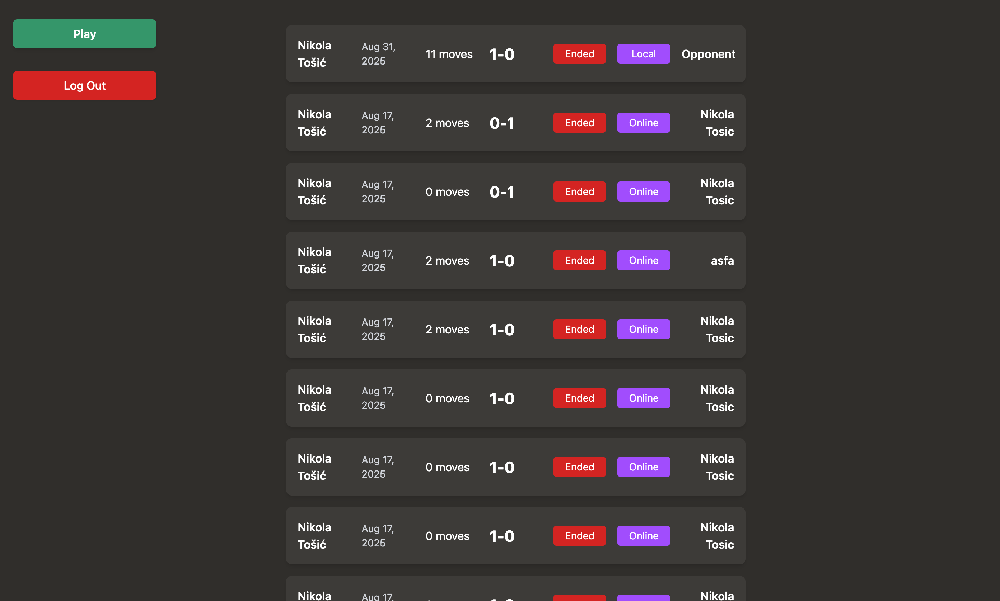

# Chess Live ♟️

A modern web-based chess platform built with **Go**, **HTMX**, **Templ**, and **PostgreSQL**.  
The app supports both **local and online play**, user authentication, match history, and game reviews.  

> ⚠️ The project is still under active development. Currently not easily testable/playable.  
> Docker setup and public hosting will be available soon.  

---

<p align="center">
  
  
  
</p>

---

## Why Chess ♟️

Simply put, I love playing chess, and it seemed like a great project to combine
my previous knowledge of frontend (with practicing "pure HTML", tailwind and making requests with HTMX),
my new-found knowledge of backend, and my love for chess.

---

## ✨ Features

- **User Accounts**: Login and signup functionality.  
- **Play Chess Locally**: Start a match on the same device.  
- **Play Chess Online**: Real-time multiplayer powered by **WebSockets**.  
- **Match History**: View a list of your past games.  
- **Game Review**: Replay old games move by move.  

---

## 🛠️ Tech Stack

- **Backend**: [Go](https://go.dev/)  
- **Frontend**: [HTMX](https://htmx.org/) + [Templ](https://templ.guide/)  
- **Database**: [PostgreSQL](https://www.postgresql.org/)  
- **Real-time Communication**: WebSockets  

---

## 🚧 Roadmap

- [x] Add **Docker support** for easy local hosting  
- [ ] Deploy to a public domain  
- [ ] Improve playability & testing environment  
- [ ] Add more robust matchmaking features  
- [ ] Add unit tests  
- [ ] Better use of Go routines
- [ ] Tighting WebSocket implementation

---

## 📦 Installation

###  Running with Docker

See [INSTALL.md](./INSTALL.md) for detailed intructions on running with Docker.

If you want to explore the code:

```bash
git clone https://github.com/NikolaTosic-sudo/chess-live
cd chess-live
```

## 🤝 Contributing

### Clone the repo

```bash
git clone https://github.com/NikolaTosic-sudo/chess-live.git
cd chess-live
```

### Submit a pull request

If you'd like to contribute, please fork the repository and open a pull request to the `main` branch.

## 📜 License
This project is licensed under the [MIT License](LICENSE).
